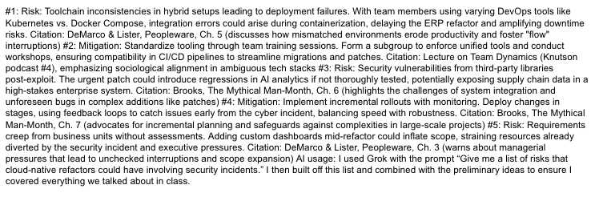
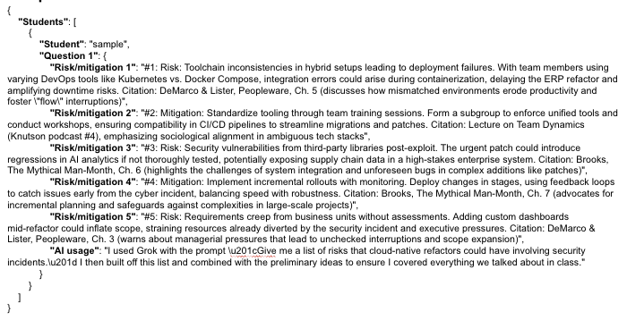
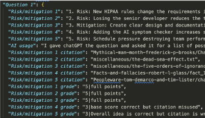
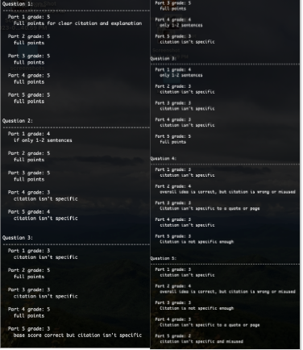

## Summary
For this project I created a multi-agent grader to help check citation and answer correctness as I graded the CS 428 midterm. 

## Examples
*Diagrams, demo video or gif, etc.*
I have slides from my in class demo in this folder that show examples of what the code and project looked like. Due to FERPA rules it was impossible for me to do a live demo, but I used the example given by the CS 428 professor to help demonstrate what potential input and ouput would look like. 

*Initial student input*

*Student input after splitting data and putting it into a JSON format*

*Format once student citations and proposed grades have been created*

*Demonstration of what suggested grade ouput looks like*

## Use of AI
*Does your project integrate with AI in any interesting way? If yes, please describe.*
This project is very AI focused. The end result was a multi agent workflow. I mostly used Open AI's API for my LLM calls. I queried the API when I was splitting the answers into segments, then again when I was finding their citations, and lastly I queried it when I was grading the actual solutions based on the course text and student responses.
*How did you use AI to assist in building your project? Please, describe.*
I was pretty unfamiliar with using Open AI's API so I ended up using AI to help write a lot of the code. This mostly consisted of me providing the data structures and desired outcome and then tweaking the generated code until it worked. 
## Why this project
*Discuss why this project is interesting to you!*
This project was very interesting to me because I've been wanting to learn more about working with agents like this! I also wanted a way to help streamline and make the grading more fair in the class. 
## Takeaways
### Key takeaways
*Key learnings from the project (please try to come up with at least 3)*
* Working with AI agents and API's is way more accessible and doable then I initially thought!
* Prompt engineering really really matters
* Standardizing data with AI is really easy for the first 90-95% but catching and fixing those last few edge cases can take a lot a lot of time
### Other takeaways
*What did you learn in this project?*
* Generative AI responses vary a lot even when they're passed nearly identical prompts and context
* Open AI API calls can be quite cheap, especially if you pass a max token cap

## Overall performance
*Explanation if applicable of failover strategy, scaling characteristics, performance characteristics, authentication, concurrency, etc.*
All in all, it didn't perform nearly as well as I hoped. I got every aspect working quite well, up until the actual grading. I struggled to find a good prompt that would get the AI to use the exact rubric and grade based on the course content. The work I did definitely helped overall, but there's still a lot of needed improvement before I can rely on it to do the actual grading. 
For a more in depth explanation of the project and performance please see the Final Report Presentation powerpoint slides in this folder!

Please note that because of FERPA and copyright laws I have not included all of my code and the files contained in the code folder won't be able to run properly.