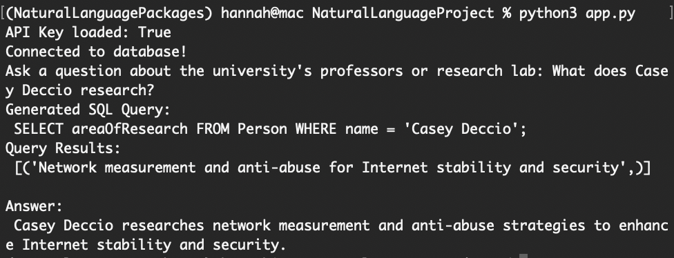

# About
The purpose of this project was to experiment with using open ai api keys. 

This project contains a small database with mock data about various professors, students, and research labs. The app.py file connects to this database and prompts a human user for a question. It uses this question to make an SQL prompt for the database, using gpt-4o-mini. It runs this SQL query and returns the result in a human readable response. 

In order to run this code, create a secrets.py file and add a line with `OPENAPI_API_KEY = "<your key>"`

Here's an example of the interface:
